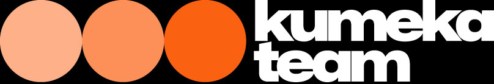
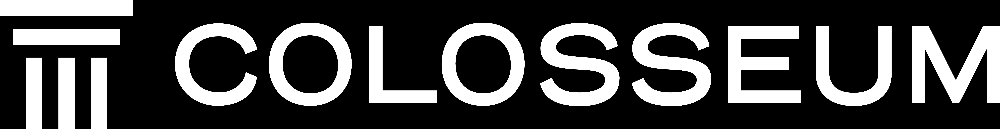
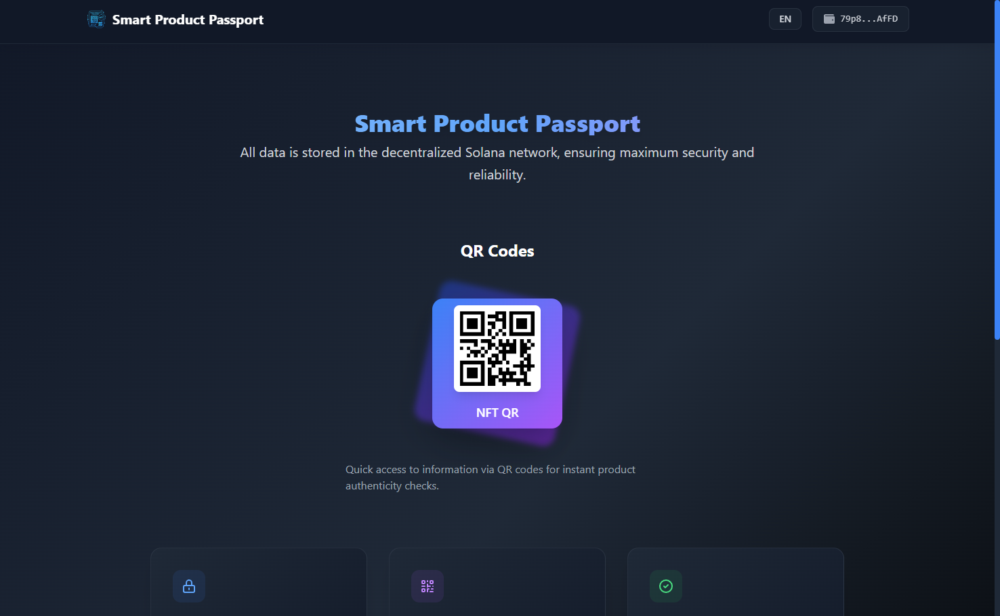

# Smart Product Passport

> Blockchain-based solution for product authentication and documentation, enabling secure digital passports for products with QR code verification and manufacturer management. Built on Solana blockchain for high performance and security.

<div align="center">
  <a href="https://arena.colosseum.org/projects/explore/smart-product-passport?previous=L3Byb2plY3RzL2V4cGxvcmU_c2VlZD1kMjk5MWNlNDQ0MmM5MmVkJmhhY2thdGhvbklkPTQmc2VhcmNoPXNt" target="_blank" rel="noopener noreferrer" style="text-decoration: none;">
    
  </a>
  
  <a href="https://arena.colosseum.org/projects/explore/smart-product-passport?previous=L3Byb2plY3RzL2V4cGxvcmU_c2VlZD1kMjk5MWNlNDQ0MmM5MmVkJmhhY2thdGhvbklkPTQmc2VhcmNoPXNt" target="_blank" rel="noopener noreferrer" style="text-decoration: none;">
    <p style="background: linear-gradient(to right, #60A5FA, #A78BFA); -webkit-background-clip: text; background-clip: text; color: transparent; margin: 10px 0; font-size: 1.1em; display: flex; align-items: center; justify-content: center; gap: 8px; cursor: pointer;">
      <span>Until June 23, 2025, you can support our product at the hackathon</span>
      <span style="font-size: 1.2em;">👍</span>
    </p>
  </a>

  <h3 style="color: white; margin: 20px 0 10px 0; font-size: 1.2em;">Supported by</h3>
  <div style="display: flex; justify-content: center; align-items: center; gap: 40px; margin-bottom: 20px;">
    <a href="https://kumekateam.com/" target="_blank" rel="noopener noreferrer" style="text-decoration: none;">
      
    </a>
    <a href="https://www.colosseum.org/" target="_blank" rel="noopener noreferrer" style="text-decoration: none;">
      
    </a>
  </div>

  <p>
    <strong>Hackathon Project</strong> 🚀
  </p>

  
</div>

---

## About Us

**Smart Product Passport** is an innovative blockchain-based solution for product authentication and documentation. Built on the Solana blockchain, our platform provides a secure, transparent, and efficient way to create, manage, and verify digital product passports.

### Key Features

- 🔐 **Secure blockchain storage**: All product data is securely stored on the Solana blockchain
- 📱 **QR code integration**: Easy product verification via QR codes
- 🏭 **Manufacturer management**: Specialized system for manufacturers to create and manage product passports
- 📄 **Documentation support**: Upload and store product documentation (PDF, DOC, images)
- 🔍 **Real-time verification**: Instant product authenticity verification
- 🌐 **Decentralized architecture**: Utilizes the high-performance Solana blockchain

---

## Project Context

This project is developed as part of the hackathon organized by **Kumeka Team** and **Colloseum**. We are proud to participate in this innovative competition that brings together the best minds in blockchain and technology.

### Partners

- **Kumeka Team**: A leading blockchain development and innovation company
- **Colloseum**: A prominent technology and innovation hub

---

## Technology Stack

- **Frontend**: React.js, TailwindCSS, Framer Motion
- **Blockchain**: Solana, Anchor Framework
- **Storage**: IPFS (for document storage)
- **Authentication**: Phantom Wallet

---

## Getting Started

### Prerequisites
- Node.js >= 18.x
- npm >= 9.x
- Phantom Wallet extension
- Solana CLI (for smart contract deployment)

### Installation

1. **Clone the repository**
   ```bash
   git clone https://github.com/yourusername/smart-product-passport.git
   cd smart-product-passport
   ```
2. **Install dependencies**
   ```bash
   cd frontend/app
   npm install
   ```
3. **Configure environment**
   - Update `/config/.env` with your `ADMIN_PUBLIC_KEY` and other required variables
   - For smart contract, update `/config/program_config.json` as needed
4. **Run the frontend**
   ```bash
   npm start
   ```
5. **Deploy smart contract (optional)**
   ```bash
   cd ../../anchor
   anchor build && anchor deploy
   ```

---

## Usage

- **Admin**: Add manufacturers via the Admin Panel
- **Manufacturer**: Create product passports and generate QR codes
- **User**: Scan QR codes to verify and mint NFT passports

---

## Screenshots

> _Add your own screenshots to `frontend/app/src/assets/screenshot.png` for best results!_

---

## License

[License information will be added here]

---

<div align="center">
  <p>Built with ❤️ for the Solana community with the support of the Kumeka Team & Colloseum Hackathon</p>
</div>

<!-- Trigger redeploy -->

<!-- Force redeploy - Update deployment --> 