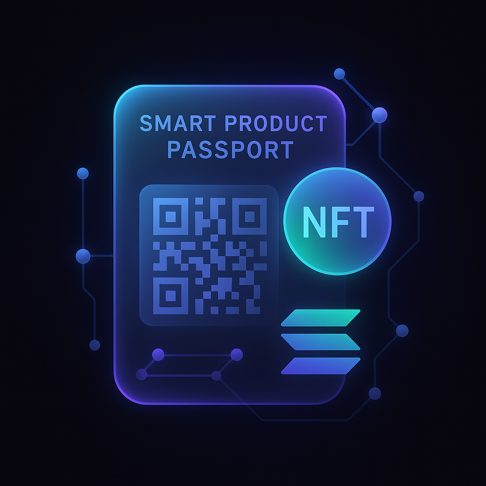

# Smart Product Passport

  
  
  

    
    
  

  

    <strong>Hackathon Project</strong> 🚀
  

## About

Smart Product Passport is an innovative blockchain-based solution that revolutionizes product authentication and documentation. Built on the Solana blockchain, our platform provides a secure, transparent, and efficient way to create, manage, and verify digital product passports.

### Key Features

- 🔐 **Secure Blockchain Storage**: All product data is securely stored on the Solana blockchain
- 📱 **QR Code Integration**: Easy product verification through QR codes
- 🏭 **Manufacturer Management**: Dedicated system for manufacturers to create and manage product passports
- 📄 **Documentation Support**: Upload and store product documentation (PDF, DOC, images)
- 🔍 **Real-time Verification**: Instant product authenticity verification
- 🌐 **Decentralized Architecture**: Leveraging Solana's high-performance blockchain

## Project Context

This project is developed as part of the hackathon organized by **Kumeka Team** and **Colloseum**. We are proud to participate in this innovative competition that brings together the best minds in blockchain and technology.

### Partners

- **Kumeka Team**: A leading blockchain development and innovation company
- **Colloseum**: A prominent technology and innovation hub

## Technology Stack

- **Frontend**: React.js, TailwindCSS, Framer Motion
- **Blockchain**: Solana, Anchor Framework
- **Storage**: IPFS (for document storage)
- **Authentication**: Phantom Wallet

## Getting Started

[Installation and setup instructions will be added here]

## License

[License information will be added here]

---

  
Built with ❤️ for the Kumeka Team & Colloseum Hackathon

 