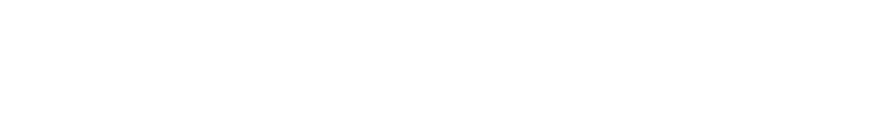

# Smart Product Passport

<div align="center">
  
  
  <p>
    
    
  </p>

  <p>
    <strong>Hackathon Project</strong> 🚀
  </p>

  
</div>

---

## About

**Smart Product Passport** is an innovative blockchain-based solution for product authentication and documentation. Built on the Solana blockchain, our platform provides a secure, transparent, and efficient way to create, manage, and verify digital product passports.

### Key Features

- 🔐 **Secure Blockchain Storage**: All product data is securely stored on the Solana blockchain
- 📱 **QR Code Integration**: Easy product verification through QR codes
- 🏭 **Manufacturer Management**: Dedicated system for manufacturers to create and manage product passports
- 📄 **Documentation Support**: Upload and store product documentation (PDF, DOC, images)
- 🔍 **Real-time Verification**: Instant product authenticity verification
- 🌐 **Decentralized Architecture**: Leveraging Solana's high-performance blockchain

---

## Project Context

This project is developed as part of the hackathon organized by **Kumeka Team** and **Colloseum**. We are proud to participate in this innovative competition that brings together the best minds in blockchain and technology.

### Partners

- **Kumeka Team**: A leading blockchain development and innovation company
- **Colloseum**: A prominent technology and innovation hub

---

## Technology Stack

- **Frontend**: React.js, TailwindCSS, Framer Motion
- **Blockchain**: Solana, Anchor Framework
- **Storage**: IPFS (for document storage)
- **Authentication**: Phantom Wallet

---

## Getting Started

### Prerequisites
- Node.js >= 18.x
- npm >= 9.x
- Phantom Wallet extension
- Solana CLI (for smart contract deployment)

### Installation

1. **Clone the repository**
   ```bash
   git clone https://github.com/yourusername/smart-product-passport.git
   cd smart-product-passport
   ```
2. **Install dependencies**
   ```bash
   cd frontend/app
   npm install
   ```
3. **Configure environment**
   - Update `/config/.env` with your `ADMIN_PUBLIC_KEY` and other required variables
   - For smart contract, update `/config/program_config.json` as needed
4. **Run the frontend**
   ```bash
   npm start
   ```
5. **Deploy smart contract (optional)**
   ```bash
   cd ../../anchor
   anchor build && anchor deploy
   ```

---

## Usage

- **Admin**: Add manufacturers via the Admin Panel
- **Manufacturer**: Create product passports and generate QR codes
- **User**: Scan QR codes to verify and mint NFT passports

---

## Screenshots

> _Add your own screenshots to `frontend/app/src/assets/screenshot.png` for best results!_

---

## License

[License information will be added here]

---

<div align="center">
  <p>Built with ❤️ for the Kumeka Team & Colloseum Hackathon</p>
</div> 